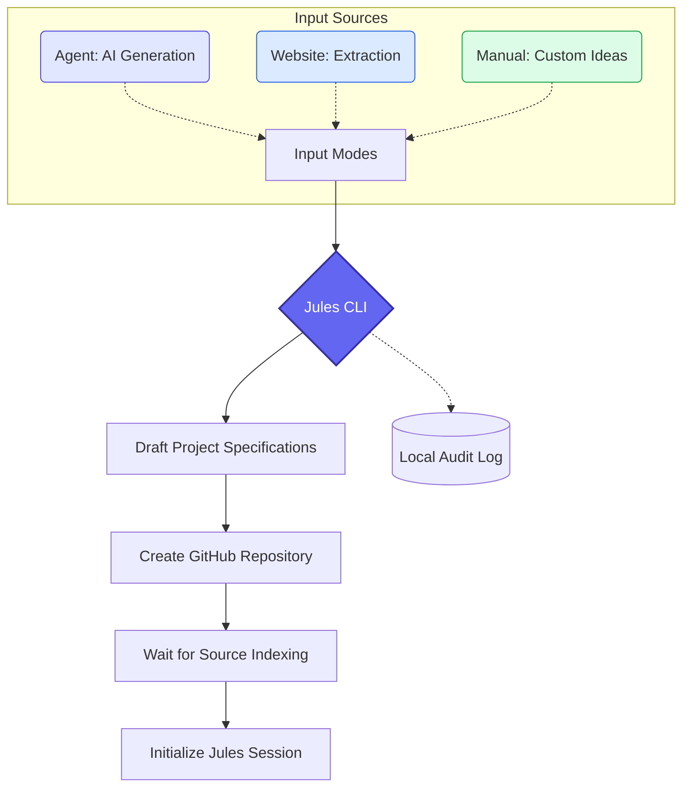

# Jules Idea Automation

<div align="center">
  
</div>

<br>

[](LICENSE)
[](https://www.python.org/downloads/)
[](https://docs.astral.sh/ruff/)
[](https://mypy-lang.org/)

An **Idea Factory** CLI that automates the full journey from _raw concept_ to a _developer-ready GitHub repository_ with a Jules AI session attached — in a single command.

---

## Table of Contents

- [Key Features](#key-features)
- [How It Works](#how-it-works)
- [Tech Stack](#tech-stack)
- [Prerequisites](#prerequisites)
- [Getting Started](#getting-started)
- [Usage](#usage)
  - [Interactive Guide](#interactive-guide)
  - [Agent Mode](#-agent-mode)
  - [Website Mode](#-website-mode)
  - [Manual Mode](#-manual-mode)
  - [Status & Sources](#status--sources)
  - [CLI Reference](#cli-reference)
- [Architecture](#architecture)
  - [Project Structure](#project-structure)
  - [Request Lifecycle](#request-lifecycle)
  - [Event Bus & Domain Events](#event-bus--domain-events)
  - [Gemini API Caching](#gemini-api-caching)
- [Environment Variables](#environment-variables)
- [Available Scripts](#available-scripts)
- [Testing](#testing)
- [Troubleshooting](#troubleshooting)
- [Contributing](#contributing)
- [License](#license)

---

## Key Features

- **Three Input Modes** — AI-generated ideas (_Agent_), website extraction (_Website_), or bring-your-own concept (_Manual_).
- **Category-Aware Ideation** — Target specific categories like `cli_tool`, `web_app`, `api_service`, `mobile_app`, `automation`, or `ai_ml`.
- **Full MVP Scaffolding** — Generates a 9-file SOLID-compliant project structure (entry point, source packages, tests, Makefile, `.env.example`, `.gitignore`) in a single atomic Git commit via the GitHub Git Data API.
- **Thinking Mode** — Leverages Gemini's `ThinkingConfig` for transparent, deep-thought rationales during idea generation.
- **Jules Session Orchestration** — Automatically waits for repository indexing and initialises an `AUTO_CREATE_PR` session so the Jules agent starts working immediately.
- **Session Monitoring** — Live-poll sessions with `--watch` to see real-time activity and PR outputs.
- **API Response Caching** — File-based cache in `.cache/` reduces Gemini latency and cost on repeated queries.
- **Audit Logging** — Every workflow execution is persisted to `.jules_history.jsonl` via an Event Bus, giving you a full history of generated ideas and sessions.
- **Resilient Generation** — Exponential backoff retries plus a comprehensive fallback scaffold if API calls time out.

---

## How It Works



1. **Idea Generation** — You provide a prompt, category, URL, or title. The CLI uses `GeminiClient` to produce a structured idea (title, description, tech stack, features).
2. **Repository Scaffolding** — `GitHubClient` creates a GitHub repo and pushes an MVP scaffold as a single atomic commit using the Git Data (Blobs → Tree → Commit → Ref) API.
3. **Source Indexing** — The CLI polls the Jules API until the new repository is discovered and indexed (default timeout: 120 s, 10 s intervals).
4. **Session Start** — `JulesClient` creates an `AUTO_CREATE_PR` session linked to the repository so the Jules agent begins development immediately.
5. **Optional Watch** — Pass `--watch` to live-poll the session until the PR is created or the timeout expires.

---

## Tech Stack

| Layer | Technology |
|---|---|
| **Language** | Python 3.12+ |
| **AI** | Google Gemini (`google-genai` SDK, `v1beta` API) |
| **VCS** | GitHub REST & Git Data API via `requests` |
| **Session Orchestration** | Jules API (`v1alpha/sessions`) |
| **Web Scraping** | BeautifulSoup 4 |
| **Data Models** | Pydantic 2.x |
| **Configuration** | `python-dotenv` |
| **Linting / Formatting** | Ruff (lint + format) |
| **Type Checking** | mypy (strict mode with Pydantic plugin) |
| **Testing** | pytest + pytest-mock + pytest-cov |

---

## Prerequisites

Before you begin, make sure you have:

- **Python 3.12 or higher** — the project uses 3.12+ features and type hints. Check with `python3 --version`.
- **pip** — Python package manager (bundled with Python 3).
- **Git** — for cloning the repository.
- **API Keys** — you will need three keys (see [Environment Variables](#environment-variables)):
  - A **Google Gemini API key** — [get one here](https://aistudio.google.com/apikey).
  - A **GitHub Personal Access Token** with `repo` scope — [create one here](https://github.com/settings/tokens).
  - A **Jules API key** — available from the Jules console.

---

## Getting Started

### 1. Clone the Repository

```bash
git clone https://github.com/julesjewels-ai/jules-idea-automation.git
cd jules-idea-automation
```

### 2. Create a Virtual Environment

```bash
python3.12 -m venv venv
source venv/bin/activate  # macOS / Linux
# On Windows: venv\Scripts\activate
```

### 3. Install Dependencies

```bash
pip install -r requirements.txt
```

This installs all runtime _and_ development dependencies (Ruff, mypy, pytest, etc.).

### 4. Configure Environment Variables

Copy the example environment file and fill in your API keys:

```bash
cp .env.example .env
```

Open `.env` in your editor and set:

```env
GEMINI_API_KEY=your_gemini_api_key_here
GITHUB_TOKEN=your_github_token_here
JULES_API_KEY=your_jules_api_key_here
```

> **Note:** The `.env` file is listed in `.gitignore` and will never be committed.

### 5. Verify the Installation

```bash
python main.py guide
```

If everything is configured correctly, you'll see the interactive user guide.

---

## Usage

### Interactive Guide

New to the tool? Start here:

```bash
# Show the main welcome guide
python main.py guide

# Show a specific workflow tutorial
python main.py guide --workflow agent
python main.py guide --workflow website
python main.py guide --workflow manual
```

### 🤖 Agent Mode

Let Gemini AI generate ideas from scratch.


```bash
# Generate a random idea
python main.py agent

# Target a specific category
python main.py agent --category cli_tool

# Generate and watch until PR is created
python main.py agent --category web_app --watch

# Create a private repository
python main.py agent --private
```

Available categories: `web_app`, `cli_tool`, `api_service`, `mobile_app`, `automation`, `ai_ml`.

### 🌐 Website Mode

Scrape a website and generate a prototype idea from its content.


```bash
# Extract an idea from a website
python main.py website --url https://example.com

# Watch session until completion
python main.py website --url https://example.com --watch
```

The scraper includes content validation that enforces minimum text length and detects blocked/login-restricted pages to prevent hallucinated ideas from invalid sources.

### ✍️ Manual Mode

Bring your own idea — provide title and optional metadata.


```bash
# Basic manual entry (slug auto-generated from title)
python main.py manual "My Awesome Tool"

# Full manual entry with all options
python main.py manual "Task Manager" \
  --description "A CLI tool for managing daily tasks with priority tags" \
  --slug my-task-cli \
  --tech_stack "Python,Click,SQLite" \
  --features "CRUD operations,Priority tags,Export CSV" \
  --watch
```

### Status & Sources

```bash
# Check session status
python main.py status <session_id>

# Watch an existing session in real time
python main.py status <session_id> --watch

# List available indexed sources
python main.py list-sources
```

### CLI Reference

| Flag | Description | Default |
|---|---|---|
| `--category` | Target a specific idea category (Agent mode) | None (random) |
| `--description` | Detailed description for Manual mode | Uses title |
| `--slug` | Custom GitHub repository slug | Auto-slugified title |
| `--url` | Target URL for Website mode | *(required)* |
| `--tech_stack` | Comma-separated list of technologies | `[]` |
| `--features` | Comma-separated list of MVP features | `[]` |
| `--private` | Create a private repository | `False` |
| `--timeout` | Timeout in seconds for indexing/watching | `1800` |
| `--watch` | Live-poll session until completion or timeout | `False` |

---

## Architecture

The codebase follows **SOLID** principles with **Dependency Injection** and **Protocol-based interfaces** for all external services, making every component testable in isolation.

### Project Structure

```
jules-idea-automation/
├── main.py                          # Entry point — orchestration only
├── pyproject.toml                   # Project metadata, Ruff, mypy, pytest config
├── requirements.in                  # Direct dependencies (pip-compile input)
├── requirements.txt                 # Locked dependencies (pip-compile output)
├── .env.example                     # Template for required environment variables
├── .jules_history.jsonl             # Audit log of workflow executions
├── .cache/                          # File-based Gemini API response cache
│
├── src/
│   ├── cli/                         # CLI layer
│   │   ├── parser.py                # argparse definitions and subcommands
│   │   └── commands.py              # Command handlers, session watching
│   │
│   ├── core/                        # Business logic layer
│   │   ├── workflow.py              # IdeaWorkflow — central orchestrator (DI)
│   │   ├── models.py                # Pydantic models (IdeaResponse, ProjectScaffold, etc.)
│   │   ├── events.py                # Domain events (WorkflowStarted, WorkflowCompleted)
│   │   ├── interfaces.py            # Protocol definitions for all services
│   │   └── readme_builder.py        # Markdown README generator for scaffolded repos
│   │
│   ├── services/                    # External service clients
│   │   ├── gemini.py                # Google Gemini API client (idea + scaffold generation)
│   │   ├── github.py                # GitHub REST + Git Data API client
│   │   ├── jules.py                 # Jules session API client
│   │   ├── scraper.py               # Web scraper with content validation
│   │   ├── cache.py                 # FileCacheProvider (CacheProvider Protocol)
│   │   ├── bus.py                   # LocalEventBus + NullEventBus implementations
│   │   ├── audit.py                 # JsonFileAuditLogger (EventHandler Protocol)
│   │   └── http_client.py           # Shared HTTP utilities
│   │
│   ├── templates/                   # Project scaffolding templates
│   │   └── feature_map.py           # Feature map template generation
│   │
│   └── utils/                       # Cross-cutting concerns
│       ├── errors.py                # Custom error hierarchy (AppError + subtypes)
│       ├── guide.py                 # Interactive guide / tutorial content
│       ├── polling.py               # Generic async polling utilities
│       ├── reporter.py              # Console output formatting (Colors, panels)
│       ├── security.py              # Security checks (e.g., .gitignore validation)
│       └── slugify.py               # Title → slug converter
│
├── tests/                           # Test suite (mirrors src/ structure)
│   ├── conftest.py                  # Shared fixtures
│   ├── cli/                         # CLI tests (commands, manual mode, watch)
│   ├── core/                        # Core logic tests
│   ├── services/                    # Service client tests (Gemini, GitHub, Jules, Scraper)
│   ├── integration/                 # Integration tests (Event Bus, Gemini caching)
│   ├── templates/                   # Template tests
│   └── utils/                       # Utility tests (reporter)
│
├── docs/                            # Documentation
│   ├── architecture.md              # Architecture deep-dive (Event Bus, Caching)
│   ├── DEVLOG.md                    # Development history / changelog
│   └── ROADMAP.md                   # Future roadmap
│
└── assets/                          # Images for README and documentation
    ├── jules_hero_banner.png
    ├── agent_mode_icon.png
    ├── website_mode_icon.png
    └── manual_mode_icon.png
```

### Request Lifecycle

Every CLI invocation follows this path:

```
main.py
  └─ load_dotenv()                   # Load .env
  └─ create_parser() → parse_args()  # Parse CLI arguments
  └─ dispatch_command(args)           # Route to handler
       └─ handle_agent | handle_website | handle_manual
            └─ _execute_and_watch(idea_data, args)  # Centralised helper (DRY)
                 ├─ IdeaWorkflow(gemini, github, jules, ...)  # Inject services
                 ├─ workflow.run()
                 │    ├─ EventBus.publish(WorkflowStarted)
                 │    ├─ GeminiClient.generate_idea()      # → Gemini API
                 │    ├─ GeminiClient.generate_scaffold()   # → Gemini API
                 │    ├─ GitHubClient.create_repo()         # → GitHub API
                 │    ├─ GitHubClient.create_files()        # → Git Data API (atomic commit)
                 │    ├─ JulesClient.wait_for_indexing()    # → Jules Sources API (poll)
                 │    ├─ JulesClient.start_session()        # → Jules Sessions API
                 │    └─ EventBus.publish(WorkflowCompleted)
                 └─ watch_session() [if --watch]
                      └─ JulesClient.list_activities()      # → Jules Activities API (poll)
```

### Event Bus & Domain Events

The project uses an in-memory synchronous Event Bus to decouple cross-cutting concerns (e.g., audit logging) from the core workflow:

| Component | Role |
|---|---|
| `EventBus` (Protocol) | Interface for `subscribe()` and `publish()` |
| `LocalEventBus` | In-memory implementation dispatching to registered handlers |
| `NullEventBus` | No-op fallback (injected by default) — eliminates null checks |
| `JsonFileAuditLogger` | Subscribes to `WorkflowStarted` / `WorkflowCompleted` and persists to `.jules_history.jsonl` |

See [`docs/architecture.md`](docs/architecture.md) for detailed class diagrams.

### Gemini API Caching

A `CacheProvider` Protocol abstracts response caching. The bundled `FileCacheProvider` writes cached Gemini responses to `.cache/`, keyed by prompt hash. The `GeminiClient` checks the cache before making API calls, reducing latency and cost on repeated queries.

---

## Environment Variables

### Required

| Variable | Description | How to Get |
|---|---|---|
| `GEMINI_API_KEY` | Google Gemini API key for idea + scaffold generation | [Google AI Studio](https://aistudio.google.com/apikey) |
| `GITHUB_TOKEN` | GitHub Personal Access Token with `repo` scope | [GitHub Settings → Tokens](https://github.com/settings/tokens) |
| `JULES_API_KEY` | Jules API key for session creation and monitoring | Jules Console |

All three are loaded automatically from `.env` via `python-dotenv`.

> **Security:** The CLI verifies that `.gitignore` blocks `.env` before any push operation to prevent accidental credential exposure.

---

## Available Scripts

| Command | Description |
|---|---|
| `python main.py guide` | Interactive getting-started tutorial |
| `python main.py agent` | Generate an AI idea and create a repo |
| `python main.py website --url <URL>` | Extract idea from a website |
| `python main.py manual "<title>"` | Create a repo from your own idea |
| `python main.py status <session_id>` | Check or watch an existing session |
| `python main.py list-sources` | List indexed sources in Jules |
| `python -m pytest tests/ -v` | Run full test suite |
| `python -m pytest tests/ --cov=src` | Run tests with coverage |
| `ruff check src/ tests/` | Lint all source and test files |
| `ruff format src/ tests/` | Auto-format all source and test files |
| `mypy src/` | Run strict type checking |
| `pip-compile requirements.in` | Re-lock dependencies |

---

## Testing

### Running Tests

```bash
# Run the full test suite
python -m pytest tests/ -v

# Run with coverage report
python -m pytest tests/ --cov=src --cov-report=term-missing

# Run a specific test file
python -m pytest tests/services/test_gemini.py -v

# Run tests matching a keyword
python -m pytest tests/ -k "scaffold" -v
```

### Test Structure

The test directory mirrors the `src/` layout:

```
tests/
├── conftest.py                  # Shared fixtures (mock clients, env setup)
├── cli/
│   ├── test_commands.py         # Command dispatch tests
│   ├── test_commands_manual.py  # Manual mode edge cases
│   └── test_watch_session.py    # Session watching tests
├── core/
│   └── test_normalize_requirements.py
├── services/
│   ├── test_gemini.py           # Gemini client tests
│   ├── test_github.py           # GitHub client tests
│   ├── test_jules.py            # Jules client tests
│   ├── test_scraper.py          # Scraper tests
│   └── test_scraper_network.py  # Network-level scraper tests
├── integration/
│   ├── test_event_bus.py        # Event Bus integration
│   └── test_gemini_caching.py   # Cache integration
├── templates/
│   └── test_feature_map.py      # Feature map template tests
└── utils/
    └── test_reporter.py         # Reporter formatting tests
```

### Writing Tests

All service dependencies are defined as Protocols, so tests use `pytest-mock` to inject fakes:

```python
import pytest
from unittest.mock import MagicMock

def test_workflow_publishes_started_event():
    """The workflow should publish a WorkflowStarted event."""
    bus = MagicMock()
    workflow = IdeaWorkflow(
        gemini=MagicMock(),
        github=MagicMock(),
        jules=MagicMock(),
        event_bus=bus,
    )
    workflow.run(idea_data)
    bus.publish.assert_any_call(ANY)  # WorkflowStarted event
```

---

## Troubleshooting

### Missing API Keys

**Error:** `Configuration Error: GEMINI_API_KEY is not set`

**Fix:**
1. Ensure `.env` exists in the project root: `cp .env.example .env`
2. Fill in all three keys (`GEMINI_API_KEY`, `GITHUB_TOKEN`, `JULES_API_KEY`).
3. Keys are loaded at startup by `python-dotenv` — no restart required.

### GitHub Token Scope

**Error:** `403 Forbidden` when creating a repository.

**Fix:** Your `GITHUB_TOKEN` needs the `repo` scope for creating repositories and pushing files. Regenerate the token at [github.com/settings/tokens](https://github.com/settings/tokens) with the correct scope.

### Source Indexing Timeout

**Error:** `Timeout waiting for source indexing`

The Jules API needs time to discover a newly created repository. This is an eventual-consistency delay.

**Fix:**
- Increase the timeout: `python main.py agent --timeout 3600`
- Or re-run with `status --watch` once indexing completes: `python main.py status <session_id> --watch`

### Gemini API Timeout / Rate Limit

**Error:** `API call timed out` or `429 Too Many Requests`

**What happens automatically:** The CLI retries with exponential backoff. If all retries fail, a comprehensive fallback scaffold is generated so you still get a functional project.

**Manual fix:** Wait a few minutes and try again, or check your Gemini API quota at [Google AI Studio](https://aistudio.google.com/).

### Scraper Returns No Content

**Error:** `Content validation failed: insufficient text length`

The website may be using client-side rendering (JavaScript) or blocking automated requests.

**Fix:** Try a different URL, or use **Manual Mode** to provide the idea directly:
```bash
python main.py manual "My Idea" --description "Inspired by example.com" --watch
```

### Virtual Environment Issues

**Error:** `ModuleNotFoundError: No module named 'src'`

**Fix:** Make sure you're running from the project root _inside_ an activated virtual environment:
```bash
source venv/bin/activate   # Activate
python main.py guide       # Verify
```

---

## Contributing

Contributions are welcome! Please see [CONTRIBUTING.md](CONTRIBUTING.md) for:

- Setup instructions
- Architecture overview
- Code style requirements (Ruff, mypy)
- Pull request process

All changes must pass the test suite (`python -m pytest tests/ -v`) and type checking (`mypy src/`) before merging.

---

## License

This project is licensed under the **MIT License** — see [LICENSE](LICENSE) for details.

Copyright © 2026 Jules Jewels AI.
