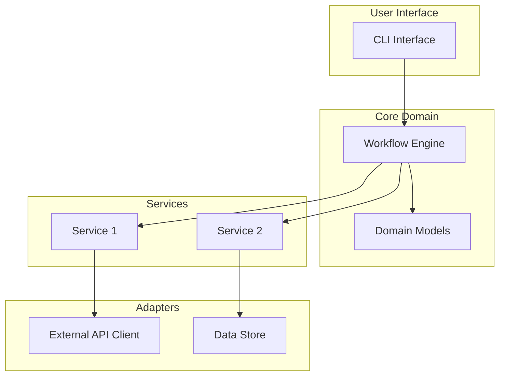
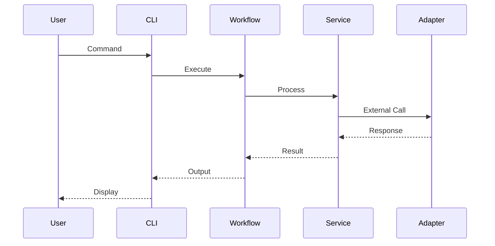

# Architecture Document

> **Status:** `DRAFT` | `REVIEW` | `LOCKED`  
> **Last Updated:** YYYY-MM-DD  
> **Owner:** Architect Agent

---

## System Overview

<!-- High-level description of the system -->

[Describe what the system does and its primary purpose]

---

## Component Diagram



---

## Component Descriptions

### Core Domain

| Component | Responsibility | Key Interfaces |
|-----------|---------------|----------------|
| `core/models.py` | Data structures | Pydantic models |
| `core/interfaces.py` | Service contracts | Abstract base classes |
| `core/domain.py` | Business logic | Domain services |

### Services

| Component | Responsibility | Dependencies |
|-----------|---------------|--------------|
| `services/` | Feature implementations | Core interfaces |

### Adapters

| Component | Responsibility | External Systems |
|-----------|---------------|------------------|
| `adapters/` | Infrastructure integration | APIs, DBs |

---

## Data Flow



---

## Technology Decisions

| Decision | Choice | Rationale |
|----------|--------|-----------|
| Language | Python 3.9+ | Team expertise, ecosystem |
| CLI Framework | Click | Simple, well-documented |
| Validation | Pydantic | Type safety, parsing |
| Testing | pytest | Standard, good plugins |

---

## Interface Contracts

### Core Interfaces (defined in `src/core/interfaces.py`)

```python
from abc import ABC, abstractmethod

class ServiceInterface(ABC):
    """Base interface for all services."""
    
    @abstractmethod
    def execute(self, input_data: dict) -> dict:
        """Execute the service operation."""
        pass
```

---

## Security Considerations

- [ ] Input validation at boundaries
- [ ] No secrets in code
- [ ] Rate limiting on external calls
- [ ] Audit logging for sensitive operations

---

## Open Questions

| ID | Question | Status |
|----|----------|--------|
| AQ-001 | | Open |
