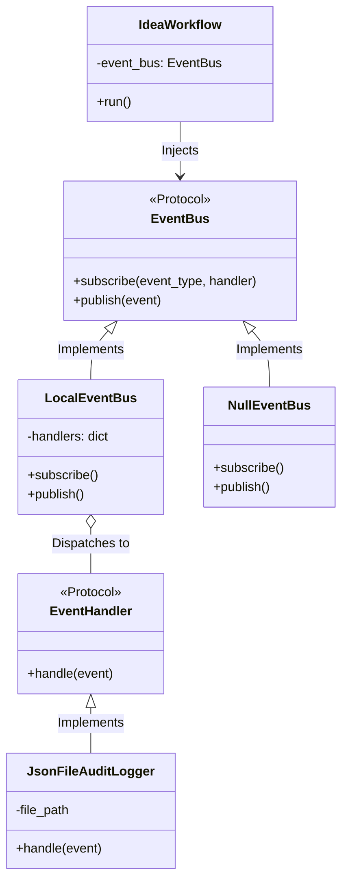
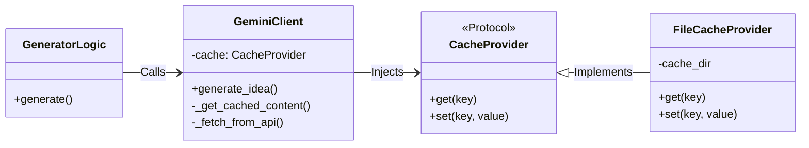

# Architecture Overview

This document describes the architectural patterns and internal structures used in **Jules Idea Automation**.

## Core Principles

The codebase is built on **SOLID** design principles, specifically leaning heavily into **Dependency Injection (DI)** and the **Open/Closed Principle (OCP)**. This pattern allows the central workflow orchestration (`IdeaWorkflow`) to be extensible without modifying its core logic. 

Dependencies like API clients, caching mechanisms, and loggers are injected via `Protocol` interfaces, ensuring decoupled and testable components. Check `src/core/interfaces.py` and `src/cli/commands.py` for how these are composed.

## Event Bus and Domain Events

To facilitate decoupled features such as localized auditing or UI reporting without interfering with workflow progression, the project implements an **Event Bus**.



### Components:
- **`EventBus` (Protocol):** The core interface for subscribing to and publishing events.
- **`LocalEventBus`:** In-memory, synchronous implementation. Iterates over registered handlers for an event type and executes them.
- **`NullEventBus`:** A no-op implementation injected by default as a fallback. This eliminates null checks inside the workflow.
- **Domain Events:** Strongly typed definitions powered by Pydantic (e.g., `WorkflowStarted`, `WorkflowCompleted`). See `src/core/events.py` for definitions.

### Subscribing to Events
Features can subscribe to these events by implementing the `EventHandler` protocol:
```python
def handle(self, event: Event) -> None:
    ...
```

## Audit Logging

Audit Logging is one example of a decoupled feature leveraging the Event Bus.
- **`JsonFileAuditLogger`:** Implements `EventHandler` to listen for domain events like `WorkflowStarted` and `WorkflowCompleted`.
- **Purpose:** It persists execution trace details and metadata locally into `.jules_history.jsonl` (JSON Lines format) so users have a history of generated ideas and sessions.

## Gemini API Caching

To reduce Google Gemini API latency and costs across repeated queries, the application utilizes a generic caching abstraction.


- **`CacheProvider` (Protocol):** An interface that provides `get(key)` and `set(key, value)` semantics.
- **`FileCacheProvider`:** A concrete implementation writing cached responses to the local `.cache/` directory.
- **Integration:** Supplied to the `GeminiClient` upon initialization. The client abstracts the lookups into private helpers (`_get_cached_content` and `_fetch_from_api`), allowing the core generator logic to remain clean.
